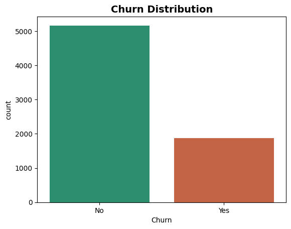
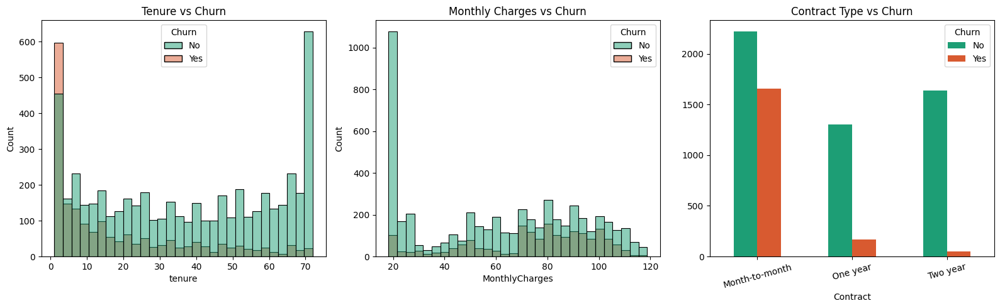
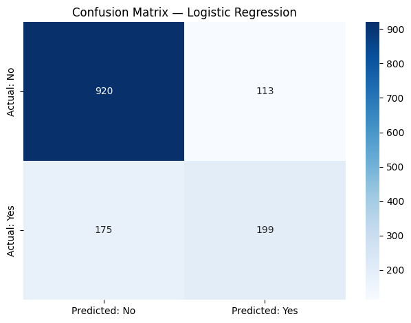
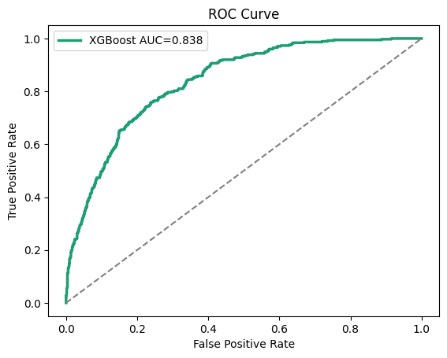
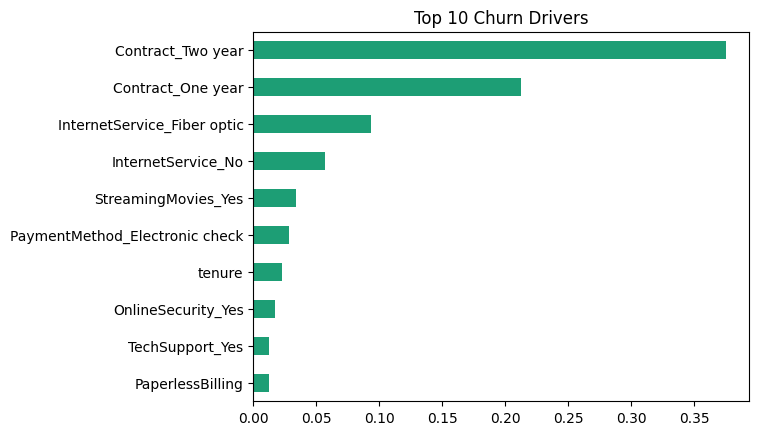

```python
!pip install seaborn
```

    Collecting seaborn
      Downloading seaborn-0.13.2-py3-none-any.whl.metadata (5.4 kB)
    Requirement already satisfied: numpy!=1.24.0,>=1.20 in c:\users\nisha\appdata\local\programs\python\python313\lib\site-packages (from seaborn) (2.4.1)
    Requirement already satisfied: pandas>=1.2 in c:\users\nisha\appdata\local\programs\python\python313\lib\site-packages (from seaborn) (3.0.0)
    Requirement already satisfied: matplotlib!=3.6.1,>=3.4 in c:\users\nisha\appdata\local\programs\python\python313\lib\site-packages (from seaborn) (3.10.9)
    Requirement already satisfied: contourpy>=1.0.1 in c:\users\nisha\appdata\local\programs\python\python313\lib\site-packages (from matplotlib!=3.6.1,>=3.4->seaborn) (1.3.3)
    Requirement already satisfied: cycler>=0.10 in c:\users\nisha\appdata\local\programs\python\python313\lib\site-packages (from matplotlib!=3.6.1,>=3.4->seaborn) (0.12.1)
    Requirement already satisfied: fonttools>=4.22.0 in c:\users\nisha\appdata\local\programs\python\python313\lib\site-packages (from matplotlib!=3.6.1,>=3.4->seaborn) (4.62.1)
    Requirement already satisfied: kiwisolver>=1.3.1 in c:\users\nisha\appdata\local\programs\python\python313\lib\site-packages (from matplotlib!=3.6.1,>=3.4->seaborn) (1.5.0)
    Requirement already satisfied: packaging>=20.0 in c:\users\nisha\appdata\local\programs\python\python313\lib\site-packages (from matplotlib!=3.6.1,>=3.4->seaborn) (26.0)
    Requirement already satisfied: pillow>=8 in c:\users\nisha\appdata\local\programs\python\python313\lib\site-packages (from matplotlib!=3.6.1,>=3.4->seaborn) (12.2.0)
    Requirement already satisfied: pyparsing>=3 in c:\users\nisha\appdata\local\programs\python\python313\lib\site-packages (from matplotlib!=3.6.1,>=3.4->seaborn) (3.3.2)
    Requirement already satisfied: python-dateutil>=2.7 in c:\users\nisha\appdata\local\programs\python\python313\lib\site-packages (from matplotlib!=3.6.1,>=3.4->seaborn) (2.9.0.post0)
    Requirement already satisfied: tzdata in c:\users\nisha\appdata\local\programs\python\python313\lib\site-packages (from pandas>=1.2->seaborn) (2025.3)
    Requirement already satisfied: six>=1.5 in c:\users\nisha\appdata\local\programs\python\python313\lib\site-packages (from python-dateutil>=2.7->matplotlib!=3.6.1,>=3.4->seaborn) (1.17.0)
    Downloading seaborn-0.13.2-py3-none-any.whl (294 kB)
    Installing collected packages: seaborn
    Successfully installed seaborn-0.13.2
    

    
    [notice] A new release of pip is available: 24.3.1 -> 26.1.1
    [notice] To update, run: python.exe -m pip install --upgrade pip
    


```python

import pandas as pd
import numpy as np
import matplotlib.pyplot as plt
import seaborn as sns
from sklearn.preprocessing import LabelEncoder, StandardScaler
from sklearn.model_selection import train_test_split
import joblib, os

# ── Reload dataset ──────────────────────────────
df = pd.read_csv("C:\\Users\\nisha\\Downloads\\WA_Fn-UseC_-Telco-Customer-Churn.csv")

# Phase 1 fixes (re-apply)
df['TotalCharges'] = pd.to_numeric(df['TotalCharges'], errors='coerce')
df = df.dropna(subset=['TotalCharges'])

print("df loaded! Shape:", df.shape)
```

    df loaded! Shape: (7032, 21)
    


```python
df = pd.read_csv("C:\\Users\\nisha\\Downloads\\WA_Fn-UseC_-Telco-Customer-Churn.csv")

print("Shape:", df.shape)
df.head()
```

    Shape: (7043, 21)
    


<div>
<style scoped>
    .dataframe tbody tr th:only-of-type {
        vertical-align: middle;
    }

    .dataframe tbody tr th {
        vertical-align: top;
    }

    .dataframe thead th {
        text-align: right;
    }
</style>
<table border="1" class="dataframe">
  <thead>
    <tr style="text-align: right;">
      <th></th>
      <th>customerID</th>
      <th>gender</th>
      <th>SeniorCitizen</th>
      <th>Partner</th>
      <th>Dependents</th>
      <th>tenure</th>
      <th>PhoneService</th>
      <th>MultipleLines</th>
      <th>InternetService</th>
      <th>OnlineSecurity</th>
      <th>...</th>
      <th>DeviceProtection</th>
      <th>TechSupport</th>
      <th>StreamingTV</th>
      <th>StreamingMovies</th>
      <th>Contract</th>
      <th>PaperlessBilling</th>
      <th>PaymentMethod</th>
      <th>MonthlyCharges</th>
      <th>TotalCharges</th>
      <th>Churn</th>
    </tr>
  </thead>
  <tbody>
    <tr>
      <th>0</th>
      <td>7590-VHVEG</td>
      <td>Female</td>
      <td>0</td>
      <td>Yes</td>
      <td>No</td>
      <td>1</td>
      <td>No</td>
      <td>No phone service</td>
      <td>DSL</td>
      <td>No</td>
      <td>...</td>
      <td>No</td>
      <td>No</td>
      <td>No</td>
      <td>No</td>
      <td>Month-to-month</td>
      <td>Yes</td>
      <td>Electronic check</td>
      <td>29.85</td>
      <td>29.85</td>
      <td>No</td>
    </tr>
    <tr>
      <th>1</th>
      <td>5575-GNVDE</td>
      <td>Male</td>
      <td>0</td>
      <td>No</td>
      <td>No</td>
      <td>34</td>
      <td>Yes</td>
      <td>No</td>
      <td>DSL</td>
      <td>Yes</td>
      <td>...</td>
      <td>Yes</td>
      <td>No</td>
      <td>No</td>
      <td>No</td>
      <td>One year</td>
      <td>No</td>
      <td>Mailed check</td>
      <td>56.95</td>
      <td>1889.5</td>
      <td>No</td>
    </tr>
    <tr>
      <th>2</th>
      <td>3668-QPYBK</td>
      <td>Male</td>
      <td>0</td>
      <td>No</td>
      <td>No</td>
      <td>2</td>
      <td>Yes</td>
      <td>No</td>
      <td>DSL</td>
      <td>Yes</td>
      <td>...</td>
      <td>No</td>
      <td>No</td>
      <td>No</td>
      <td>No</td>
      <td>Month-to-month</td>
      <td>Yes</td>
      <td>Mailed check</td>
      <td>53.85</td>
      <td>108.15</td>
      <td>Yes</td>
    </tr>
    <tr>
      <th>3</th>
      <td>7795-CFOCW</td>
      <td>Male</td>
      <td>0</td>
      <td>No</td>
      <td>No</td>
      <td>45</td>
      <td>No</td>
      <td>No phone service</td>
      <td>DSL</td>
      <td>Yes</td>
      <td>...</td>
      <td>Yes</td>
      <td>Yes</td>
      <td>No</td>
      <td>No</td>
      <td>One year</td>
      <td>No</td>
      <td>Bank transfer (automatic)</td>
      <td>42.30</td>
      <td>1840.75</td>
      <td>No</td>
    </tr>
    <tr>
      <th>4</th>
      <td>9237-HQITU</td>
      <td>Female</td>
      <td>0</td>
      <td>No</td>
      <td>No</td>
      <td>2</td>
      <td>Yes</td>
      <td>No</td>
      <td>Fiber optic</td>
      <td>No</td>
      <td>...</td>
      <td>No</td>
      <td>No</td>
      <td>No</td>
      <td>No</td>
      <td>Month-to-month</td>
      <td>Yes</td>
      <td>Electronic check</td>
      <td>70.70</td>
      <td>151.65</td>
      <td>Yes</td>
    </tr>
  </tbody>
</table>
<p>5 rows × 21 columns</p>
</div>


```python
print("=== Data Types ===")
print(df.dtypes)
print("\n=== Missing Values ===")
print(df.isnull().sum())
```

    === Data Types ===
    customerID              str
    gender                  str
    SeniorCitizen         int64
    Partner                 str
    Dependents              str
    tenure                int64
    PhoneService            str
    MultipleLines           str
    InternetService         str
    OnlineSecurity          str
    OnlineBackup            str
    DeviceProtection        str
    TechSupport             str
    StreamingTV             str
    StreamingMovies         str
    Contract                str
    PaperlessBilling        str
    PaymentMethod           str
    MonthlyCharges      float64
    TotalCharges            str
    Churn                   str
    dtype: object
    
    === Missing Values ===
    customerID          0
    gender              0
    SeniorCitizen       0
    Partner             0
    Dependents          0
    tenure              0
    PhoneService        0
    MultipleLines       0
    InternetService     0
    OnlineSecurity      0
    OnlineBackup        0
    DeviceProtection    0
    TechSupport         0
    StreamingTV         0
    StreamingMovies     0
    Contract            0
    PaperlessBilling    0
    PaymentMethod       0
    MonthlyCharges      0
    TotalCharges        0
    Churn               0
    dtype: int64
    


```python
df['TotalCharges'] = pd.to_numeric(df['TotalCharges'], errors='coerce')

print("Blank rows found:", df['TotalCharges'].isnull().sum())

# Drop those 11 rows (new customers, tenure=0)
df = df.dropna(subset=['TotalCharges'])
print("Clean dataset shape:", df.shape)
```

    Blank rows found: 11
    Clean dataset shape: (7032, 21)
    


```python
churn_pct = df['Churn'].value_counts(normalize=True) * 100
print(df['Churn'].value_counts())
print(f"\nChurn Rate: {churn_pct['Yes']:.1f}%")

sns.countplot(x='Churn', data=df,
              palette=['#1D9E75', '#D85A30'])
plt.title('Churn Distribution', fontsize=14, fontweight='bold')
plt.savefig('churn_dist.png', dpi=150, bbox_inches='tight')
plt.show()
```

    Churn
    No     5163
    Yes    1869
    Name: count, dtype: int64
    
    Churn Rate: 26.6%
    

    C:\Users\nisha\AppData\Local\Temp\ipykernel_27416\3481254976.py:5: FutureWarning: 
    
    Passing `palette` without assigning `hue` is deprecated and will be removed in v0.14.0. Assign the `x` variable to `hue` and set `legend=False` for the same effect.
    
      sns.countplot(x='Churn', data=df,
    


    

    


```python
fig, axes = plt.subplots(1, 3, figsize=(16, 5))

# Chart 1: Tenure
sns.histplot(data=df, x='tenure', hue='Churn',
             bins=30, ax=axes[0],
             palette=['#1D9E75','#D85A30'])
axes[0].set_title('Tenure vs Churn')

# Chart 2: Monthly Charges
sns.histplot(data=df, x='MonthlyCharges', hue='Churn',
             bins=30, ax=axes[1],
             palette=['#1D9E75','#D85A30'])
axes[1].set_title('Monthly Charges vs Churn')

# Chart 3: Contract Type
contract_data = df.groupby(['Contract','Churn']).size().unstack()
contract_data.plot(kind='bar', ax=axes[2],
                    color=['#1D9E75','#D85A30'])
axes[2].set_title('Contract Type vs Churn')
axes[2].tick_params(axis='x', rotation=15)

plt.tight_layout()
plt.savefig('eda_charts.png', dpi=150, bbox_inches='tight')
plt.show()
```


    

    


```python
mtm = df[df['Contract']=='Month-to-month']['Churn']
yr2 = df[df['Contract']=='Two year']['Churn']
new_cust = df[df['tenure']<=12]['Churn']

print(f"Month-to-month churn: {mtm.value_counts(normalize=True)['Yes']*100:.1f}%")
print(f"Two-year contract churn: {yr2.value_counts(normalize=True)['Yes']*100:.1f}%")
print(f"New customer churn (<=12mo): {new_cust.value_counts(normalize=True)['Yes']*100:.1f}%")
```

    Month-to-month churn: 42.7%
    Two-year contract churn: 2.8%
    New customer churn (<=12mo): 47.7%
    


```python
from sklearn.preprocessing import LabelEncoder, StandardScaler
from sklearn.model_selection import train_test_split
import joblib, os
```


```python
df = df.drop('customerID', axis=1)

# Encode target column: Yes=1, No=0
df['Churn'] = (df['Churn'] == 'Yes').astype(int)

print("Shape after drop:", df.shape)
print("Churn value counts:", df['Churn'].value_counts().to_dict())
```

    Shape after drop: (7032, 20)
    Churn value counts: {0: 5163, 1: 1869}
    


```python
binary_cols = ['gender', 'Partner', 'Dependents',
               'PhoneService', 'PaperlessBilling']

le = LabelEncoder()
for col in binary_cols:
    df[col] = le.fit_transform(df[col].astype(str))

print("Binary encoding done!")
df[binary_cols].head(3)
```

    Binary encoding done!
    


<div>
<style scoped>
    .dataframe tbody tr th:only-of-type {
        vertical-align: middle;
    }

    .dataframe tbody tr th {
        vertical-align: top;
    }

    .dataframe thead th {
        text-align: right;
    }
</style>
<table border="1" class="dataframe">
  <thead>
    <tr style="text-align: right;">
      <th></th>
      <th>gender</th>
      <th>Partner</th>
      <th>Dependents</th>
      <th>PhoneService</th>
      <th>PaperlessBilling</th>
    </tr>
  </thead>
  <tbody>
    <tr>
      <th>0</th>
      <td>0</td>
      <td>1</td>
      <td>0</td>
      <td>0</td>
      <td>1</td>
    </tr>
    <tr>
      <th>1</th>
      <td>1</td>
      <td>0</td>
      <td>0</td>
      <td>1</td>
      <td>0</td>
    </tr>
    <tr>
      <th>2</th>
      <td>1</td>
      <td>0</td>
      <td>0</td>
      <td>1</td>
      <td>1</td>
    </tr>
  </tbody>
</table>
</div>


```python
multi_cols = ['MultipleLines', 'InternetService',
              'OnlineSecurity', 'OnlineBackup',
              'DeviceProtection', 'TechSupport',
              'StreamingTV', 'StreamingMovies',
              'Contract', 'PaymentMethod']

df = pd.get_dummies(df, columns=multi_cols, drop_first=True)

print("Shape after one-hot encoding:", df.shape)
print("Total features now:", df.shape[1] - 1)
```

    Shape after one-hot encoding: (7032, 31)
    Total features now: 30
    


```python
df['AvgMonthlySpend'] = df['TotalCharges'] / (df['tenure'] + 1)

# Feature 2: New customer flag (high-risk group from EDA!)
df['IsNewCustomer'] = (df['tenure'] <= 12).astype(int)

# Feature 3: High value customer flag
df['HighValueCustomer'] = (
    df['MonthlyCharges'] > df['MonthlyCharges'].median()
).astype(int)

print("3 new features created!")
print("New customers in dataset:", df['IsNewCustomer'].sum())
print("High value customers:", df['HighValueCustomer'].sum())
```

    3 new features created!
    New customers in dataset: 2175
    High value customers: 3513
    


```python
scaler = StandardScaler()
num_cols = ['tenure', 'MonthlyCharges',
            'TotalCharges', 'AvgMonthlySpend']

df[num_cols] = scaler.fit_transform(df[num_cols])

print("Scaling done!")
print(df[num_cols].describe().round(2))
```

    Scaling done!
            tenure  MonthlyCharges  TotalCharges  AvgMonthlySpend
    count  7032.00         7032.00       7032.00          7032.00
    mean     -0.00            0.00         -0.00            -0.00
    std       1.00            1.00          1.00             1.00
    min      -1.28           -1.55         -1.00            -1.64
    25%      -0.95           -0.97         -0.83            -1.08
    50%      -0.14            0.18         -0.39             0.07
    75%       0.92            0.83          0.67             0.85
    max       1.61            1.79          2.82             1.96
    


```python
X = df.drop('Churn', axis=1)   # all features
y = df['Churn']                  # target column

X_train, X_test, y_train, y_test = train_test_split(
    X, y,
    test_size=0.2,      # 80% train, 20% test
    random_state=42,   # reproducible results
    stratify=y          # keep same churn ratio in both sets
)

print(f"Training rows: {X_train.shape[0]}")
print(f"Test rows:     {X_test.shape[0]}")
print(f"Features:      {X_train.shape[1]}")
print(f"Churn in train: {y_train.mean()*100:.1f}%")
print(f"Churn in test:  {y_test.mean()*100:.1f}%")
```

    Training rows: 5625
    Test rows:     1407
    Features:      33
    Churn in train: 26.6%
    Churn in test:  26.6%
    


```python
os.makedirs('churn_project', exist_ok=True)
joblib.dump((X_train, X_test, y_train, y_test),
            'churn_project/data_splits.pkl')
joblib.dump(scaler, 'churn_project/scaler.pkl')
```


    ['churn_project/scaler.pkl']


```python

from sklearn.linear_model import LogisticRegression
from sklearn.metrics import accuracy_score, classification_report, confusion_matrix

# Train the model
model_lr = LogisticRegression(max_iter=1000, random_state=42)
model_lr.fit(X_train, y_train)

# Predict
y_pred = model_lr.predict(X_test)

# Results
print(f"Accuracy: {accuracy_score(y_test, y_pred)*100:.1f}%")
print(classification_report(y_test, y_pred, target_names=['No Churn','Churned']))

# Confusion matrix
cm = confusion_matrix(y_test, y_pred)
sns.heatmap(cm, annot=True, fmt='d', cmap='Blues',
            xticklabels=['Predicted: No','Predicted: Yes'],
            yticklabels=['Actual: No','Actual: Yes'])
plt.title('Confusion Matrix — Logistic Regression')
plt.tight_layout()
plt.savefig('confusion_matrix_lr.png', dpi=150)
plt.show()
```

    Accuracy: 79.5%
                  precision    recall  f1-score   support
    
        No Churn       0.84      0.89      0.86      1033
         Churned       0.64      0.53      0.58       374
    
        accuracy                           0.80      1407
       macro avg       0.74      0.71      0.72      1407
    weighted avg       0.79      0.80      0.79      1407
    
    


    

    


```python
import sys
!{sys.executable} -m pip install xgboost
```

    Requirement already satisfied: xgboost in c:\users\nisha\appdata\local\programs\python\python313\lib\site-packages (3.2.0)
    Requirement already satisfied: numpy in c:\users\nisha\appdata\local\programs\python\python313\lib\site-packages (from xgboost) (2.4.1)
    Requirement already satisfied: scipy in c:\users\nisha\appdata\local\programs\python\python313\lib\site-packages (from xgboost) (1.17.1)
    

    
    [notice] A new release of pip is available: 24.3.1 -> 26.1.1
    [notice] To update, run: python.exe -m pip install --upgrade pip
    


```python
# ── Phase 4: XGBoost ─────────────────────────────────────
from xgboost import XGBClassifier
from sklearn.metrics import roc_auc_score, roc_curve

# Train XGBoost
xgb = XGBClassifier(n_estimators=200, max_depth=4, learning_rate=0.05,
                     eval_metric='logloss', random_state=42, scale_pos_weight=3)
xgb.fit(X_train, y_train)
xgb_pred  = xgb.predict(X_test)
xgb_proba = xgb.predict_proba(X_test)[:,1]

print(f"Accuracy : {accuracy_score(y_test, xgb_pred)*100:.1f}%")
print(f"AUC Score: {roc_auc_score(y_test, xgb_proba):.3f}")
print(classification_report(y_test, xgb_pred, target_names=['No Churn','Churned']))

# ROC Curve
fpr, tpr, _ = roc_curve(y_test, xgb_proba)
plt.plot(fpr, tpr, color='#1D9E75', linewidth=2.5,
         label=f'XGBoost AUC={roc_auc_score(y_test,xgb_proba):.3f}')
plt.plot([0,1],[0,1],'--', color='gray')
plt.title('ROC Curve')
plt.xlabel('False Positive Rate')
plt.ylabel('True Positive Rate')
plt.legend()
plt.savefig('roc_curve.png', dpi=150)
plt.show()

# Feature importance
feat_imp = pd.Series(xgb.feature_importances_, index=X.columns)
feat_imp.sort_values().tail(10).plot(kind='barh', color='#1D9E75')
plt.title('Top 10 Churn Drivers')
plt.savefig('feature_importance.png', dpi=150)
plt.show()
```

    Accuracy : 72.4%
    AUC Score: 0.838
                  precision    recall  f1-score   support
    
        No Churn       0.91      0.70      0.79      1033
         Churned       0.49      0.80      0.61       374
    
        accuracy                           0.72      1407
       macro avg       0.70      0.75      0.70      1407
    weighted avg       0.79      0.72      0.74      1407
    
    


    

    


    

    


```python

```
